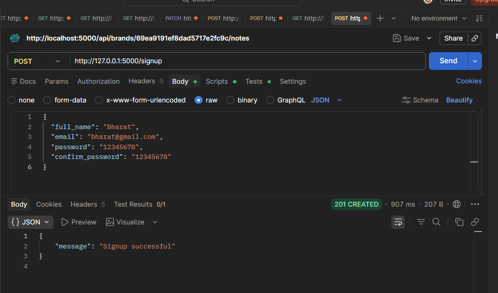
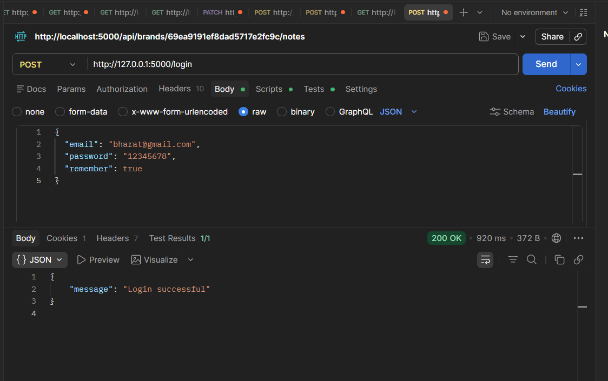
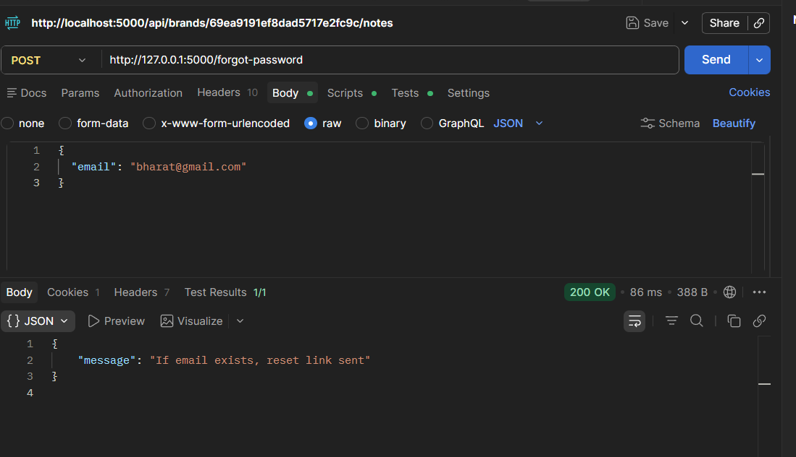
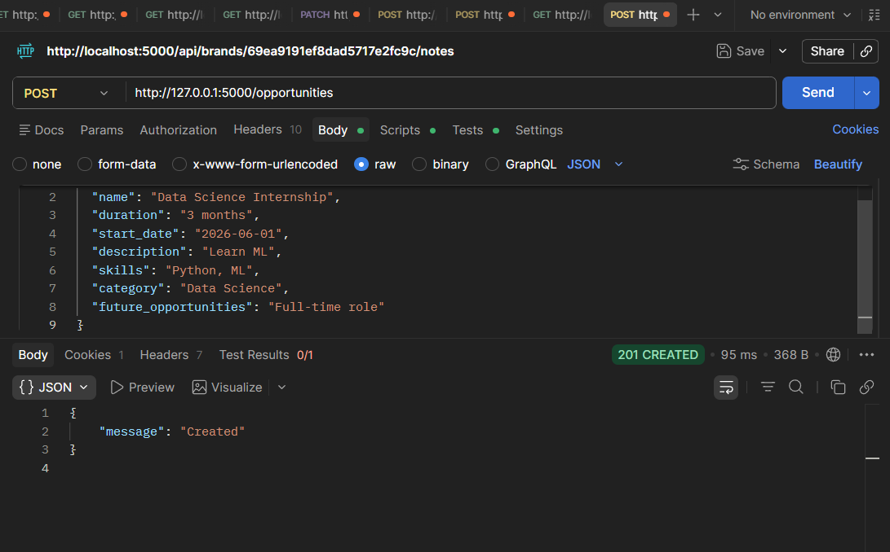
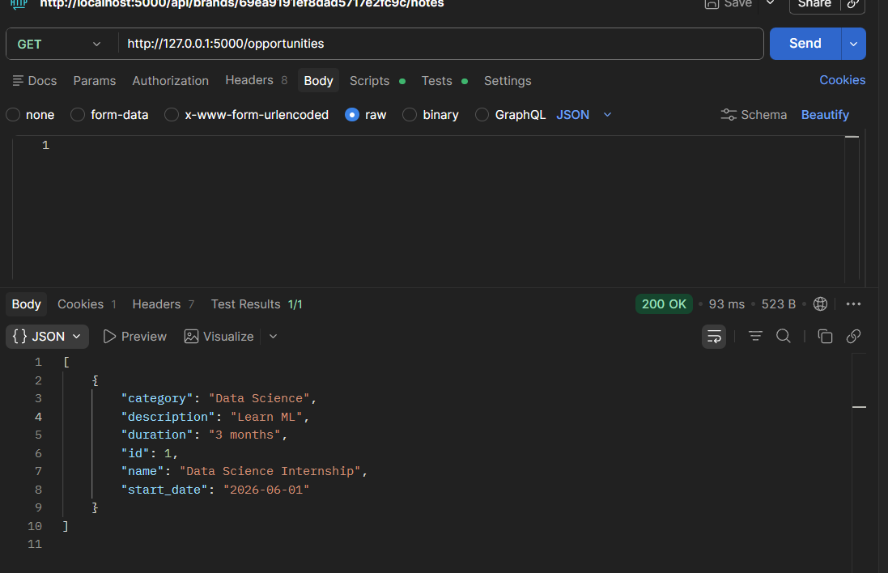
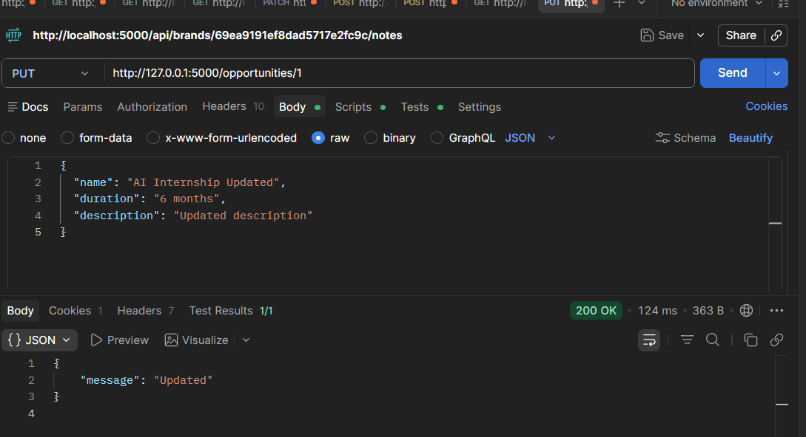
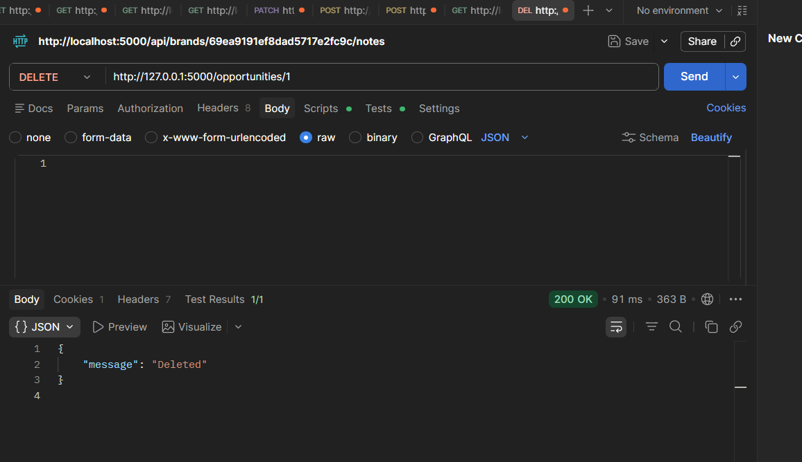

# 🌐 Admin Portal – Sky Foundation

## 📌 Project Overview

This project is a full-stack **Admin Dashboard Web Application** built using **Flask (Python)** for the backend and **HTML, CSS, JavaScript** for the frontend.

The system allows administrators to manage opportunities efficiently with secure login and session-based authentication.

---

## 🚀 Features

### 🔐 Authentication

* Admin login using email and password
* Session-based authentication
* Secure password hashing using Bcrypt

### 📊 Dashboard

* Clean and modern UI dashboard
* Displays key analytics and statistics
* Responsive design

### 🎯 Opportunity Management

* Add new opportunities
* View all opportunities
* Delete opportunities
* Backend validation for data integrity

---

## 🛠️ Tech Stack

### Backend:

* Python (Flask)
* SQLAlchemy (ORM)
* Flask-CORS
* Bcrypt

### Frontend:

* HTML5
* CSS3
* JavaScript (Vanilla JS)

---

## 📁 Project Structure

qatar-admin-backend/
│
├── app.py
├── models.py
├── extensions.py
├── config.py
│
├── routes/
│   ├── auth_routes.py
│   ├── opportunity_routes.py
│
├── frontend/
│   ├── admin.html
│   ├── admin.js
│   ├── admin.css
│
├── .gitignore
├── README.md

---

## ⚙️ Installation & Setup

### 1️⃣ Clone Repository

git clone https://github.com/your-username/qatar-admin-backend.git
cd qatar-admin-backend

---

### 2️⃣ Create Virtual Environment

python -m venv venv
venv\Scripts\activate

---

### 3️⃣ Install Dependencies

pip install flask flask_sqlalchemy flask_bcrypt flask_cors

---

### 4️⃣ Run the Server

python app.py

---

### 5️⃣ Open Frontend

Open this file in browser:
frontend/admin.html

---

## 🔥 Key Learnings

* Session-based authentication in Flask
* Handling CORS and cookies
* REST API development
* Full-stack integration (frontend + backend)
* Debugging real-world issues (401 Unauthorized, cookies, sessions)

---

## 📌 Future Improvements

* JWT Authentication
* Role-based access control
* React frontend integration
* Deployment (AWS / Render / Railway)

---
## 📸 Screenshots

### 🔐 Signup API

### 🔐 Login API

### 🔐 Forgot Password API

### ➕ Create Opportunity (POST)

### 📥 Get Opportunities (GET)

### ✏️ Update Opportunity (PUT)

### ❌ Delete Opportunity (DELETE)

---

## 👨‍💻 Author

Bharat 

---

## ⭐ GitHub

If you like this project, give it a ⭐ on GitHub!
